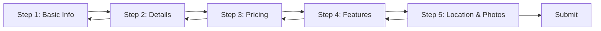

# Multi-Step Property Form Modal - Architecture Plan

## Problem Statement

The current full-page property creation form has layout issues where the header renders above the viewport, requiring excessive margin adjustments. A multi-step modal approach will:

- Eliminate layout issues entirely
- Improve user experience with manageable form sections
- Provide better mobile responsiveness
- Create a more modern, focused interface

## Current Form Analysis

### Form Fields (19 total)

1. **Basic Information** (2 fields)
   - name (text)
   - description (textarea)

2. **Fees** (3 fields)
   - pricePerMonth (number)
   - securityDeposit (number)
   - applicationFee (number)

3. **Property Details** (6 fields)
   - beds (number)
   - baths (number)
   - squareFeet (number)
   - isPetsAllowed (switch)
   - isParkingIncluded (switch)
   - propertyType (select)

4. **Amenities and Highlights** (2 fields)
   - amenities (select)
   - highlights (select)

5. **Photos** (1 field)
   - photoUrls (file upload)

6. **Location** (5 fields)
   - address (text)
   - city (text)
   - state (text)
   - postalCode (text)
   - country (text)

## Proposed Multi-Step Architecture

### Step Structure (5 Steps)

**Step 1: Basic Information**

- Property Name
- Description
- Property Type
- Purpose: Capture essential identifying information

**Step 2: Property Details**

- Beds, Baths, Square Feet
- Pets Allowed, Parking Included
- Purpose: Define physical characteristics

**Step 3: Pricing**

- Price per Month
- Security Deposit
- Application Fee
- Purpose: Set financial terms

**Step 4: Features**

- Amenities
- Highlights
- Purpose: Highlight property selling points

**Step 5: Location & Photos**

- Address, City, State, Postal Code, Country
- Photo Upload
- Purpose: Complete listing with location and visuals

### Component Architecture

```
AddPropertyModal (Main Container)
├── Dialog (shadcn/ui)
│   ├── DialogContent
│   │   ├── DialogHeader
│   │   │   ├── DialogTitle
│   │   │   └── Step Indicator (1/5, 2/5, etc.)
│   │   ├── Form (react-hook-form)
│   │   │   └── StepContent (Dynamic based on current step)
│   │   │       ├── Step1BasicInfo
│   │   │       ├── Step2PropertyDetails
│   │   │       ├── Step3Pricing
│   │   │       ├── Step4Features
│   │   │       └── Step5LocationPhotos
│   │   └── DialogFooter
│   │       ├── Back Button (hidden on step 1)
│   │       ├── Next Button (steps 1-4)
│   │       └── Submit Button (step 5)
```

### State Management

**Form State**

- Use existing `react-hook-form` with `zodResolver`
- Keep existing `propertySchema` validation
- Form persists across steps (no data loss)

**Step State**

- `currentStep` (number 1-5)
- `isSubmitting` (boolean)
- Navigation functions: `nextStep()`, `prevStep()`, `goToStep(n)`

**Validation Strategy**

- Validate current step fields before allowing "Next"
- Use `trigger()` from react-hook-form to validate specific fields
- Show validation errors inline
- Final validation on submit

### Navigation Flow



### User Experience Features

1. **Progress Indicator**
   - Visual step indicator showing 1/5, 2/5, etc.
   - Progress bar showing completion percentage
   - Step titles for context

2. **Navigation**
   - "Back" button (except step 1)
   - "Next" button (steps 1-4) - disabled if current step invalid
   - "Create Property" button (step 5)
   - "Cancel" button (all steps) - confirms before closing if data entered

3. **Validation Feedback**
   - Real-time validation on blur
   - Error messages below fields
   - Prevent navigation to next step if current step invalid
   - Summary of errors if submit fails

4. **Data Persistence**
   - Form data persists when navigating between steps
   - No data loss on back/next navigation
   - Optional: Save draft to localStorage

## Implementation Plan

### Phase 1: Create Base Components

1. Create `AddPropertyModal` component
2. Implement step navigation logic
3. Add progress indicator UI
4. Set up form state management

### Phase 2: Create Step Components

1. `Step1BasicInfo.tsx` - Basic information fields
2. `Step2PropertyDetails.tsx` - Property characteristics
3. `Step3Pricing.tsx` - Financial information
4. `Step4Features.tsx` - Amenities and highlights
5. `Step5LocationPhotos.tsx` - Location and photos

### Phase 3: Integration

1. Update `newproperty/page.tsx` to trigger modal
2. Keep existing API integration (`useCreatePropertyMutation`)
3. Maintain existing form submission logic
4. Add success/error handling with toast notifications

### Phase 4: Polish

1. Add animations for step transitions
2. Implement keyboard navigation (Enter for next, Esc for cancel)
3. Add loading states
4. Test responsive design
5. Add accessibility features (ARIA labels, focus management)

## Technical Decisions

### Why Dialog/Modal?

- Eliminates viewport/layout issues
- Focuses user attention
- Better mobile experience
- Modern UX pattern

### Why 5 Steps?

- Balances granularity with simplicity
- Each step has clear purpose
- Prevents overwhelming users
- Logical grouping of related fields

### Reusability

- `AddPropertyModal` can be reused for editing properties
- Step components are modular and maintainable
- Navigation logic can be extracted to custom hook

### Validation

- Per-step validation prevents frustration
- Users get immediate feedback
- Reduces errors at submission
- Maintains existing schema validation

## Files to Create/Modify

### New Files

- `client/src/components/AddPropertyModal.tsx` - Main modal component
- `client/src/components/property-form-steps/Step1BasicInfo.tsx`
- `client/src/components/property-form-steps/Step2PropertyDetails.tsx`
- `client/src/components/property-form-steps/Step3Pricing.tsx`
- `client/src/components/property-form-steps/Step4Features.tsx`
- `client/src/components/property-form-steps/Step5LocationPhotos.tsx`
- `client/src/hooks/useMultiStepForm.ts` (optional custom hook)

### Modified Files

- `client/src/app/(dashboard)/managers/newproperty/page.tsx` - Trigger modal instead of full form
- Potentially `client/src/app/(dashboard)/tenants/managers/newproperty/page.tsx` - Same changes

## Success Criteria

- ✅ Modal opens and closes properly
- ✅ All form fields accessible across steps
- ✅ Navigation works (next/back/cancel)
- ✅ Validation prevents invalid progression
- ✅ Form submission works with existing API
- ✅ No layout/viewport issues
- ✅ Responsive on mobile devices
- ✅ Accessible (keyboard navigation, screen readers)
- ✅ Better UX than current full-page form
